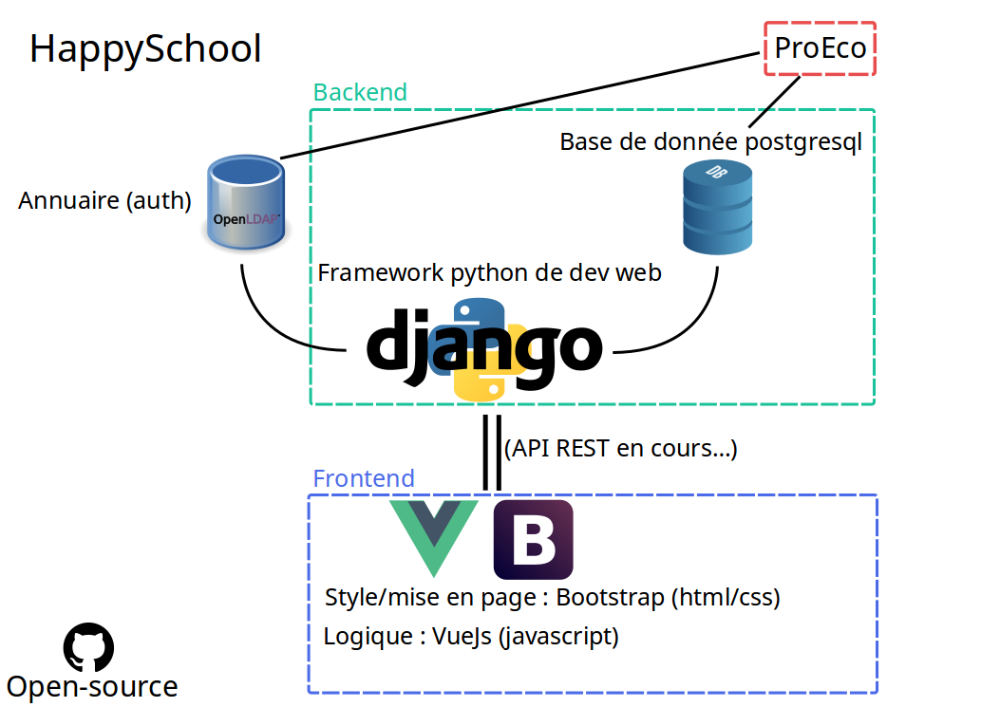

Développement
=============

La volonté derrière l'architecture d'Happyschool est de garder une certaine
simplicité autour de composants matures et flexibles. De manière générale,
Happyschool peut être divisé en deux parties. Un *back-end* qui s'occupe du
stockage des données et de la logique interne. Et un *front-end* qui s'occupe
d'afficher les données à l'utilisateur final ainsi que de la logique de
l'interface.

Back-end
--------
Le cœur du *back-end* est pris en charge par Django, un framework python abordable
et complet. Sa [documentation](https://docs.djangoproject.com/en/2.0/) est très
fournie et est une aide précieuse pour le développement. Le stockage et le
traitement des données est quant à lui gérer par [PostgreSQL](https://www.postgresql.org/).
Django propose une couche d'abstraction qui génère en interne les commandes SQL,
il n'y a donc pas – ou très peu – d'interaction directe avec PostgreSQL. En fait,
Django s'inspire très largement du principe [MVC](https://fr.wikipedia.org/wiki/Mod%C3%A8le-vue-contr%C3%B4leur),
il propose ainsi cette couche d'abstraction pour gérer l'aspect *modèle*
ainsi que toute la logique autour des données – le *contrôleur*. Django
propose également un système de [gabarit](https://docs.djangoproject.com/fr/2.0/topics/templates/)
– pour la partie *vue*. Toutefois, la gestion du rendu côté serveur (et
donc par django et son système de gabarit) rend difficile et surtout peu
pratique le dynamisme de l'interface de l'utilisateur final (la page web).
C'est [Vue.js](https://fr.vuejs.org), un framework javascript, qui va se
charger de la partie interface – la partie *vue*. L'interaction entre les
deux va se faire au travers d'une API [REST](https://fr.wikipedia.org/wiki/Representational_state_transfer)
avec une sérialisation en JSON. C'est l'excellent [Django REST framework](https://www.django-rest-framework.org/)
qui va permettre la création de l'API et s'occuper de la sérialisation/désérialisation.

Front-end
---------
C'est donc le framework Vue.js qui va se charger de l'interface web, les
deux points forts de celui-ci sont, sa facilité de mise en œuvre et la
réactivité aux changements qu'il offre. Son principe est de definir une
série de données et les transformations sur la partie html lorsque ces
données changent. Cette façon de faire permet une séparation claire des
différentes parties du code et donc une meilleure vue d'ensemble (sans
mauvais jeu de mots). En ce qui concerne le style, le *css*, c'est le
très connu [Bootstrap](https://getbootstrap.com/docs/4.0) qui est utilisé
et qui s'intègre à Vue.js avec le module [Bootstrap-vue](https://bootstrap-vue.js.org/).
Finalement, c'est [Webpack](https://webpack.js.org/), un empaqueteur, qui
orchestre toute la partie javascript (interprétation, assemblage,
minification, etc).
